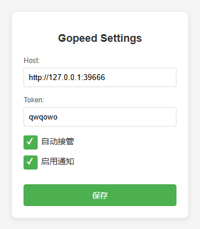
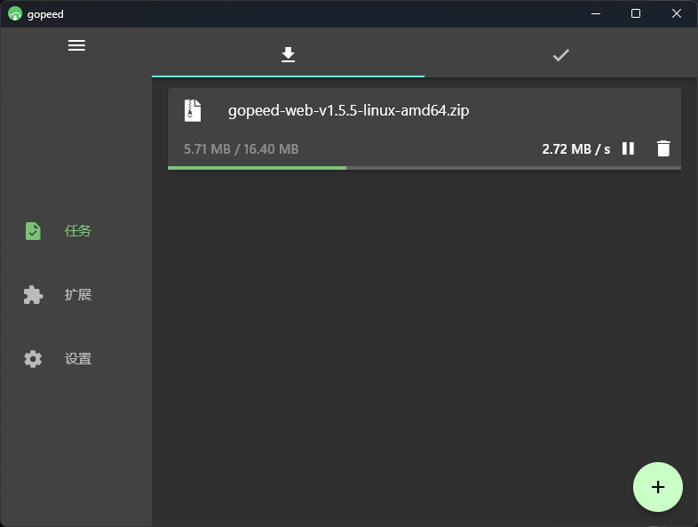

#  Gopeed

[Gopeed](https://gopeed.com/zh-CN) 的 Chrome 系浏览器插件, 将下载行为传递到 Gopeed 下载器

  

  

## 安装与使用

由于 Chrome 商店开发者注册要 5 美刀, 本人不想出这个钱.

所以目前要使用开发者模式安装解压缩的插件.

在 Releases 页面下载最新的 `Gopeed-Chrome-Extension.zip` 文件, 解压缩到一个目录.

在 Chrome 的扩展程序页面, 开启开发者模式, 点击 "加载已解压的扩展程序", 选择刚才解压缩的目录.

安装后, 要[开启 Gopeed 的 API](https://docs.gopeed.com/zh/dev-api.html) , 并在插件设置中正确填写你设置的地址 (Host) 和令牌 (Token).

注意 Host 要带上协议头, 如 `http://` 或 `https://`.

